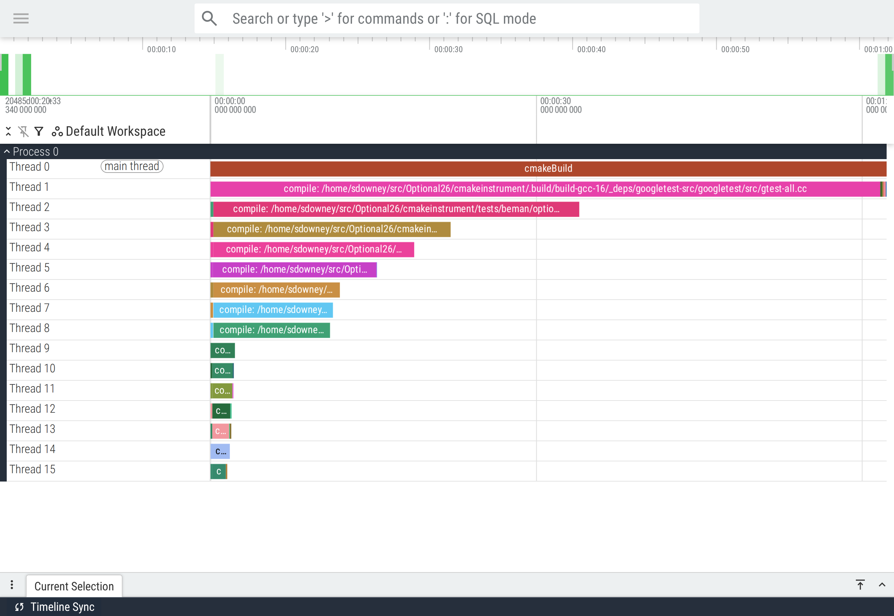

# Beman Project Infrastructure Repository

<!-- SPDX-License-Identifier: Apache-2.0 WITH LLVM-exception -->

This repository contains the infrastructure for The Beman Project. This is NOT a library repository,
so it does not respect the usual structure of a Beman library repository nor The Beman Standard!

## Description

* `cmake/`: CMake modules and toolchain files used by Beman libraries.
* `containers/`: Containers used for CI builds and tests in the Beman org.

## Usage

This repository is intended to be used as a beman-submodule in other Beman repositories. See
[the beman-submodule documentation](https://github.com/bemanproject/beman-submodule) for details.


### CMake Modules


#### `beman_install_library`

The CMake modules in this repository are intended to be used by Beman libraries. Use the
`beman_add_install_library_config()` function to install your library, along with header
files, any metadata files, and a CMake config file for `find_package()` support.

```cmake
add_library(beman.something)
add_library(beman::something ALIAS beman.something)

# ... configure your target as needed ...

find_package(beman-install-library REQUIRED)
beman_install_library(beman.something)
```

Note that the target must be created before calling `beman_install_library()`. The module
also assumes that the target is named using the `beman.something` convention, and it
uses that assumption to derive the names to match other Beman standards and conventions.
If your target does not follow that convention, raise an issue or pull request to add
more configurability to the module.

The module will configure the target to install:

* The library target itself
* Any public headers associated with the target
* CMake files for `find_package(beman.something)` support

Some options for the project and target will also be supported:

* `BEMAN_INSTALL_CONFIG_FILE_PACKAGES` - a list of package names (e.g., `beman.something`) for which to install the config file
  (default: all packages)
* `<BEMAN_NAME>_INSTALL_CONFIG_FILE_PACKAGE` - a per-project option to enable/disable config file installation (default: `ON` if the project is top-level, `OFF` otherwise). For instance for `beman.something`, the option would be `BEMAN_SOMETHING_INSTALL_CONFIG_FILE_PACKAGE`.

# BuildTelemetry

The cmake modules in this library provide access to CMake instrumentation data in Google Trace format which is visualizable with chrome://tracing and https://ui.perfetto.dev.

Telemetry may be enabled either by adding to the CMAKE_PROJECT_TOP_LEVEL_INCLUDES
```sh
-DCMAKE_PROJECT_TOP_LEVEL_INCLUDES=infra/cmake/BuildTelemetry.cmake
```
or by calling explicitly within the CMakeList.txt file.
```cmake
find_package(BuildTelemetry)
configure_build_telemetry()
```

In either form, CMake will call `telemetry.sh` which will copy the trace data in json format into a `.trace` subdirectory within the build directory.

Multiple calls to `configure_build_telemetry` will only configure the callback hooks once, so it is safe to include multiple times, including by TOP_LEVEL_INCLUDE.


